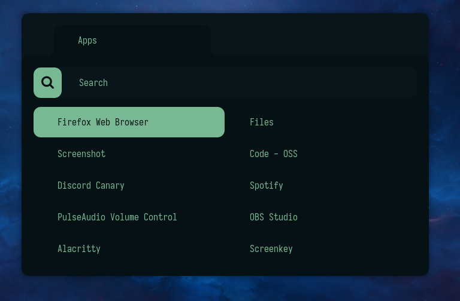

# Night for rofi

Clean and dark colorscheme for rofi



## Installation

To install it simply copy the configuration files to `~/.config/rofi`

```sh
# backup your old configuration if you have it
if test -d $HOME/.config/rofi; then mv $HOME/.config/rofi $HOME/.config/rofi.BAK; fi
# clone and copy configurations
git clone https://github.com/NightCS/rofi.git rofi
mv rofi $HOME/.config
```

DOne!
